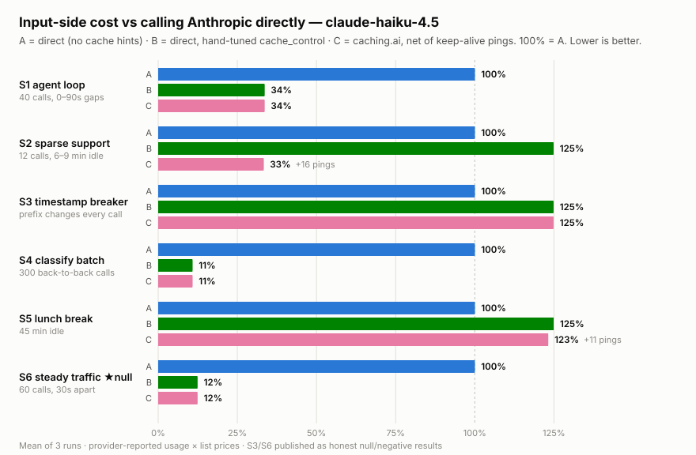
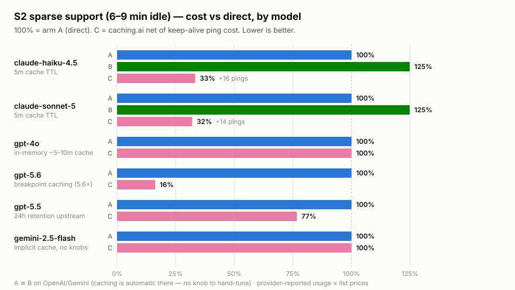

[English](BENCHMARK.md) | [한국어](BENCHMARK.ko.md) | [日本語](BENCHMARK.ja.md) | [中文](BENCHMARK.zh.md) | **Español**

# ¿Caching.ai ahorra dinero de verdad? Lo medimos.

Tres brazos, seis patrones de tráfico, siete modelos, **más de 10.000
llamadas API reales a precios de lista** (2026-07, proxy v0.10.0). Todo lo
de aquí es reproducible con tus propias claves — el método, las fixtures, el
runner y los logs en bruto están en [`bench/`](bench/README.es.md).

**Brazos.** A = proveedor llamado directamente, sin pistas de caché
(defaults del SDK). B = directo, con `cache_control` colocado a mano
exactamente donde nuestro proxy lo pondría (solo Anthropic —
OpenAI/Gemini/Grok cachean automáticamente, así que ahí A ≡ B). C = las
mismas peticiones a través de caching.ai, **netas del coste de los pings de
keep-alive**. Los costes son tokens de uso reportados por el proveedor ×
precios de lista públicos; guiones de conversación fijos; tokens de sal por
brazo para que los brazos nunca puedan compartir una caché del proveedor.
Detalles: [`bench/README.es.md`](bench/README.es.md).

<picture>
  <source media="(prefers-color-scheme: dark)" srcset=".github/assets/bench-scenarios-dark.svg">
  
</picture>

## Donde caching.ai gana

| carga de trabajo (claude-haiku-4.5) | A directo | C caching.ai (neto) | ahorro |
|---|---|---|---|
| S2 soporte disperso — 12 llamadas, 6–9 min inactivo | $0.0720 | **$0.0240** (incl. 16 pings) | **67%** |
| S1 bucle de agente — 40 llamadas, pausas de 0–90 s | $0.4104 | **$0.1378** | **66%** |
| S4 lote de clasificación — 300 llamadas | $1.7268 | **$0.1868** | **89%** |
| S6 tráfico constante — 60 llamadas, cada 30 s | $0.3123 | **$0.0387** | **88%** |

Mismo patrón en claude-sonnet-5: S2 **68%**, S1 **69%** de ahorro frente a
directo.

Dos cosas explican esto:

1. **El caching de Anthropic es opt-in, y la mayoría de integraciones nunca
   optan.** La tasa de aciertos del brazo A es 0% en todas las celdas de
   Anthropic — así es el tráfico con defaults del SDK. C inyecta los
   breakpoints automáticamente e iguala al token al B ajustado a mano
   (S1/S4/S6: B y C idénticos byte a byte).
2. **Los TTL cortos mueren en las pausas de inactividad.** En S2, el B
   ajustado a mano de hecho cuesta un **25% más que el A ingenuo**: su caché
   expira en cada pausa de 6–9 min, así que paga doce veces la prima de
   escritura de 1,25× y no lee nada. El keep-alive de C mantiene el prefijo
   caliente (91% de tasa de aciertos) y aun así gana un 67% después de pagar
   cada ping.

## GPT-5.6: el proxy restaura el caching que los nuevos modelos perdieron

Los modelos de la generación GPT-5.6 pasaron a un **caching acotado por
breakpoints**, y el breakpoint implícito está en el *último mensaje* — así
que el tráfico normal de SDK con un system prompt compartido obtiene **0% de
aciertos de prefijo entre peticiones** (medimos miles de llamadas en
`gpt-5.6-sol`: solo los prompts repetidos idénticos byte a byte llegan a
acertar). El proxy inyecta el remedio documentado — un
`prompt_cache_breakpoint` explícito al final del prefijo compartido más un
`prompt_cache_key` estable — tanto en chat/completions como en la Responses
API, siempre que la petición no lleve parámetros de caching propios. Medido
(`gpt-5.6-sol`, mismo arnés y brazos que arriba):

| carga de trabajo | A directo (tasa de aciertos) | C caching.ai (tasa de aciertos) | ahorro |
|---|---|---|---|
| S6 tráfico constante — 60 llamadas, cada 30 s | $1.6964 (0%) | **$0.1705 (97.8%)** | **90%** |
| S2 soporte disperso — 12 llamadas, 6–9 min inactivo | $0.3911 (0%) | **$0.0636 (91.0%)** | **84%** |

<picture>
  <source media="(prefers-color-scheme: dark)" srcset=".github/assets/bench-s2-models-dark.svg">
  
</picture>

## Notas sobre el comportamiento de los proveedores de modelos

- **OpenAI (pre-5.6), Gemini, Grok**: estos proveedores retienen sus cachés
  en el upstream por sí solos, así que el proxy deja pasar el tráfico sin
  tocarlo — sin pings, sin claves de enrutado inyectadas, sin primas de
  escritura. Medido en S2 disperso: gpt-4o **$0.0878 vs $0.0878** (idéntico,
  87,7% de aciertos en ambos casos) y gemini-2.5-flash **$0.0190 vs
  $0.0190** — coste de pass-through byte a byte. (gpt-5.5 salió un 23% más
  barato a través del proxy en nuestra repetición — varianza del enrutado de
  caché del lado del proveedor; espera paridad.) Encima obtienes medición,
  diagnóstico de rompedores y controles de presupuesto.
- **Los prefijos inestables** (un timestamp o un ID aleatorio en el system
  prompt) no los puede cachear nadie. El proxy nombra el rompedor y su causa
  raíz probable en el dashboard, y pausa automáticamente su propia inyección
  mientras el prefijo siga cambiando — así un prompt roto nunca compra
  primas de escritura.
- **Retenciones en caliente** ("keep my cache warm for 2 hours" en el chat):
  las retenciones largas se sirven como una sola escritura de caché con TTL
  de 1 h más un refresco cada hora; las cortas se puentean con pings de
  0,1× — lo que resulte más barato para la ventana que pediste.

**Latencia.** El salto del proxy fue menor que el ruido del proveedor en la
mayoría de celdas: los deltas p50 de TTFT fueron de −77 ms (C más rápido,
aciertos de caché) a +121 ms (celdas de pass-through puro).

## Reprodúcelo

```sh
node bench/setup-keys.mjs
node bench/orchestrate.mjs --run-id run-$(date +%Y%m%d) --budget 150
node bench/analyze.mjs --run-id run-...
```

El JSONL en bruto de cada celda publicada (secretos redactados en el momento
de escritura, fallos incluidos) está bajo
[`bench/results/run-202607-v0100/`](bench/results/run-202607-v0100/), con
agregados por celda en su `summary.md`. Precios: precios de lista públicos a
2026-07 (ver `bench/lib/pricing.mjs`). Salvedades: una sola región (cliente
en Seúl); las celdas de Anthropic son la media de 3 ejecuciones
independientes, las celdas de la era GPT-5.6 y de pass-through se midieron
en proxy v0.10.0 con 1 ejecución por celda.
