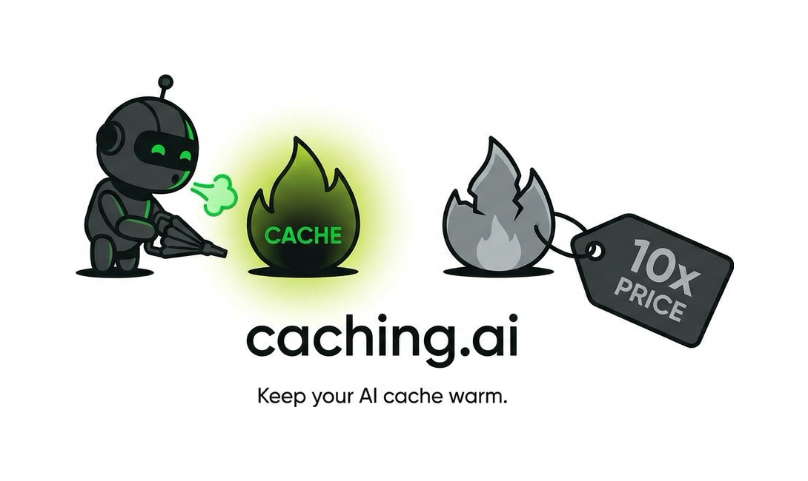

[English](README.md) | [한국어](README.ko.md) | [日本語](README.ja.md) | [中文](README.zh.md) | **Español**

<p align="center">
  <picture>
    <source media="(prefers-color-scheme: dark)" srcset="apps/web/public/logo-dark.png">
    
  </picture>
</p>

<p align="center">
  <b>El proxy que mantiene caliente tu caché de prompts de IA — y baja tu factura.</b><br/>
  Compatible sin cambios con Anthropic, OpenAI, Gemini y Grok. Solo cambias la base URL.
</p>

<p align="center">
  <a href="LICENSE"></a>
  <a href="https://www.npmjs.com/package/cache-guard"></a>
  <a href="https://caching.ai"></a>
</p>

---

Los proveedores de modelos ya descuentan ~90% los prefijos de prompt
repetidos — pero solo mientras la caché sigue caliente. Con tráfico real,
expira en silencio (≈5 minutos de inactividad) o se rompe (un solo byte
inestable en el prefijo), y vuelves a pagar el precio completo. Caching.ai se
sitúa entre tu app y el proveedor y hace que el descuento se aplique de
verdad:

- **Analítica de caché** — tasa de aciertos real, dólares ahorrados y la
  cifra que nadie te muestra: dólares desperdiciados en prompts que deberían
  haberse cacheado. Solo recuentos de tokens; los cuerpos de prompt/respuesta
  nunca se almacenan.
- **Cache guard** — inyección automática de `cache_control` (Anthropic),
  restauración de caché en GPT-5.6+ (la generación 5.6 solo hace match en
  breakpoints, así que los prefijos compartidos ingenuos obtienen 0% de
  aciertos entre peticiones — inyectamos un `prompt_cache_breakpoint`
  explícito más un `prompt_cache_key` ESTABLE, verificado en vivo
  0% → 99,6% de aciertos de prefijo), y detección de rompedores de caché con
  la causa raíz probable (timestamps, IDs aleatorios, tools reordenadas).
- **Calentador de caché (keep-alive)** *(opt-in por clave, solo Anthropic — por
  diseño)* — pings de 1 token recalientan tu prefijo exactamente mientras
  reutilizarlo es económico (hasta 62,5 min), dentro de un presupuesto diario
  que tú controlas. Los demás proveedores retienen sus cachés en el upstream
  por sí solos (lo medimos — [BENCHMARK.es.md](BENCHMARK.es.md)), así que el
  proxy nunca gasta tu presupuesto donde un ping no puede rentar. Las
  retenciones largas se sirven como una sola escritura con TTL de 1 h en vez
  de un flujo de pings. ¿Te vas a ausentar? Escribe
  `"keep my cache warm for 2 hours"` en el chat — el proxy lo responde por
  sí mismo y mantiene el calentamiento (ver abajo).
- **Optimizador de prefijos** — mide qué parte de tu prompt cambia entre
  peticiones y te dice cómo arreglarlo.

<p align="center">
  
</p>

**Medido, no prometido:** comparamos caching.ai con llamar directamente a
los proveedores — tres brazos, seis patrones de tráfico, ~10k llamadas
reales facturadas, logs en bruto publicados en el repo y reejecutables con
tus propias claves. Ver [BENCHMARK.es.md](BENCHMARK.es.md).

Funciona con cualquier SDK — la integración es un cambio de base URL:

```bash
# before
ANTHROPIC_BASE_URL=https://api.anthropic.com
# after
ANTHROPIC_BASE_URL=https://your-proxy-host   # or https://proxy.caching.ai
ANTHROPIC_API_KEY=ck_your_caching_ai_key
```

## Retenciones en caliente, explicadas en sencillo

Envía un mensaje corto de chat a través de cualquier SDK — el proxy lo
intercepta, responde al instante y nunca lo reenvía al upstream, así que
cuesta cero tokens:

```
"keep my cache warm for 2 hours"
"캐시 2시간 지켜줘" · "キャッシュを2時間保温して"
"mantén mi caché caliente 2 horas" · "帮我保温缓存 2 小时"
cai:hold 45m          # explicit command — works anywhere, any language

→ 🔥 Warming held for 2 hours. (answered at the proxy, $0)
```

Por defecto 2 h, acotado entre 5 min y 12 h. Funciona en todas las rutas —
Anthropic Messages, chat y responses de OpenAI (Codex), Gemini, Grok — y
responde en el idioma en el que preguntaste (ko/en/ja/es/zh). El mensaje
debe ser corto (≤ 60 caracteres) y tratar claramente sobre la caché;
cualquier cosa que parezca un prompt real pasa sin tocarse. El keep-alive
debe estar habilitado en la clave, y el presupuesto diario de calentamiento
sigue aplicando. La consola muestra una insignia
"Warm hold active · until HH:MM" mientras dura.

## Cloud vs. autoalojamiento

| | **Caching.ai Cloud** | **Autoalojado** |
|---|---|---|
| Operación | Cero — nosotros ejecutamos el proxy, el daemon de calentamiento y el dashboard 24/7 | Lo ejecutas tú |
| Precio | 20% de tu *ahorro neto verificado*, se exime si es menos de $5/mes | Gratis para siempre |
| Infraestructura de cobro | Pospago con tarjeta registrada, verificación de ahorro incluida | No hace falta |
| Empezar | [caching.ai](https://caching.ai) — 2 minutos | `docker compose up` abajo |

Si no te ahorramos nada, no pagas nada — ese es todo el modelo de precios.

## Qué añade la nube gestionada

El autoalojamiento te da el proxy completo. La nube añade las partes que son
pesadas de operar por tu cuenta:

- **Auto-Tune** *(solo nube — [`ee/`](ee/README.md))*: aprende el ritmo real
  de llamadas de cada clave y sigue re-eligiendo la configuración de caché
  más barata cuando tu tráfico cambia. La capa "configúralo y olvídate"
  encima del Piloto automático.
- **Facturación por ahorro verificado**: medimos lo que de verdad ahorraste —
  neto de cada señal de calentamiento — y cobramos el 20% de eso. Menos de
  $5/mes queda exento. Si no ahorras, no pagas.
- **Informes listos desde el primer día**: el email semanal de ahorro y las
  alertas diarias de presupuesto llegan sin configurar nada (autoalojado
  necesitas tu propia clave de Resend).
- **Cero operaciones**: la flota de proxies, el daemon de calentamiento,
  Postgres, migraciones y cada upgrade son nuestro busca, no el tuyo.
- **2 minutos hasta el primer ahorro**: [caching.ai](https://caching.ai) →
  registra tus claves de proveedor → cambia una base URL.

## Autoalojamiento

Requisitos: Docker + Docker Compose.

```bash
git clone https://github.com/caching-ai/caching.ai.git
cd caching.ai
cp .env.example .env          # then fill in the two secrets:
# ENCRYPTION_KEY=$(openssl rand -hex 32)
# SESSION_SECRET=$(openssl rand -hex 32)
docker compose up -d --build
```

- Consola web → http://localhost:3000
- Proxy → http://localhost:8787 (liveness: `/healthz`, readiness: `/readyz` —
  comprueba la base de datos)

Regístrate en la consola, registra tus claves API de proveedor (cifradas en
reposo con AES-256-GCM), crea una clave `ck_` y apunta la base URL de tu SDK
al proxy. Las migraciones de Postgres se ejecutan automáticamente cuando el
proxy arranca.

Integraciones opcionales (todas desactivadas por defecto): Google OAuth
(`GOOGLE_CLIENT_ID/SECRET`), email transaccional (`RESEND_API_KEY` — habilita
la verificación de registro, el informe semanal de ahorro y las alertas de
presupuesto de keep-alive, todo con baja en un clic conforme a RFC 8058),
métricas de Prometheus (`METRICS_TOKEN` → `GET /metrics` con
`authorization: Bearer <token>`: contadores de peticiones/tokens/coste/ahorro,
coste de pings de keep-alive, histograma de latencia, gauges del pool de la
BD), ajuste de retención de logs en bruto (`LOG_RETENTION_DAYS`, por defecto
100 — los días completos se consolidan en `request_logs_daily` antes de
purgarse), overrides de URL de upstream (`UPSTREAM_URL`,
`OPENAI_UPSTREAM_URL`, `GEMINI_UPSTREAM_URL`, `GROK_UPSTREAM_URL`), y el
pipeline de cobro pospago (`BILLING_LIVE=1` + claves de Stripe/Toss — casi
seguro que no lo quieres autoalojado). Cada opción está listada con
comentarios en [.env.example](.env.example).

## Arquitectura

Monorepo pnpm:

```
apps/proxy          Hono proxy — key exchange, usage metering from the live
                    stream (SSE passthrough, no buffering), cache_control
                    injection, breaker detection, keep-alive scheduler,
                    savings/billing sweeps
apps/web            Next.js console — dashboard, key management, billing
packages/shared     pricing tables, crypto, db + forward-only migrations
packages/cache-guard-cli   `npx cache-guard` — scan a repo for cache breakers
ee/                 source-visible, commercially licensed (see ee/README.md) —
                    adaptive cache tuning that powers the cloud's Auto-Tune
```

### Atrapa rompedores de caché en CI

[`cache-guard`](https://www.npmjs.com/package/cache-guard) es una pequeña
CLI de npm que hashea el prefijo cacheable (tools, system, primer mensaje)
de fixtures de peticiones de Anthropic Messages — para que el PR que
accidentalmente desestabiliza el prefijo de tu prompt falle en CI en vez de
multiplicar por 10 tu factura en silencio:

```bash
npx cache-guard snapshot fixtures/*.json   # write the .cacheguard.json baseline
npx cache-guard check fixtures/*.json      # exit 1 if any prefix hash changed
```

Modelo de privacidad: el proxy almacena recuentos de tokens, nombres de
modelo, latencia, códigos de estado y hashes SHA-256 de los bloques de
prefijo — nunca cuerpos de prompt ni de respuesta. La única excepción es el
keep-alive opt-in, que almacena el último prefijo de prompt cifrado
(AES-256-GCM), porque reenviarlo es lo que mantiene la caché caliente. Es tu
base de datos — verifica todo esto en el código.

## Desarrollo

```bash
pnpm install
cd apps/proxy && pnpm test    # needs local Postgres 16
cd apps/web && pnpm dev
```

Ver [CONTRIBUTING.md](CONTRIBUTING.md). Reportes de seguridad: [SECURITY.md](SECURITY.md).

## Licencia

[Apache-2.0](LICENSE) © 2026 AI3 Inc. — todo lo que hay en este repositorio
EXCEPTO el directorio `ee/`, cuyo código es visible bajo una licencia
comercial (ver [ee/README.md](ee/README.md)); las builds autoalojadas
funcionan por completo sin él. "caching.ai" y el logo de la llama son marcas
registradas de AI3 Inc. — ver [NOTICE](NOTICE).
